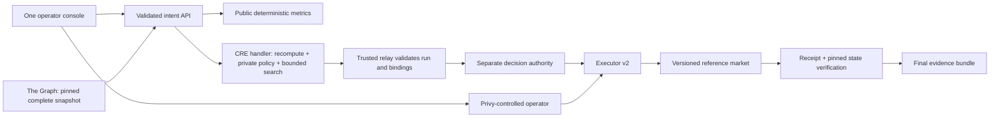

# ParamShield Architecture

> Authorization update (2026-09-09): new console flows use the bounded
> [exact-state grant and fresh-observation design](decisions/0002-exact-state-authorization.md).
> Legacy snapshot-bound approvals keep their original semantics.

**Revision:** 2026-09-07. See
[ADR 0001](decisions/0001-risk-and-execution-boundaries.md) and
[implementation status](implementation-plan.md); this describes the target.

## Data and hash dependency order

1. Validate chain/addresses/calldata, nonce, expiry, market version, and
   executor authorization epoch. Create `intentCore` without hashes of future
   evidence.
2. Query all Graph positions at one block/hash. Check indexing status, totals,
   freshness, configuration, and manifest version. Corroborate against RPC at
   that block; RPC does not replace the Graph input on failure.
3. Run the four-cell deterministic simulation. Canonical public input and output
   form `preflightHash` (the Solidity `evidenceHash` field).
4. ABI-hash the exact intent plus preflight hash, executor, and operator into
   `changeHash`. No receipt or decision is included in the preflight hash.
5. Run the CRE confidential handler, reusing the pure risk engine to recompute
   metrics and search candidates **inside** the handler with the secret policy.
6. Validate a structured result bound to changeHash/preflightHash/expiry. Hash
   this public decision into `decisionHash`; the separate authority records it.
7. BLOCK/ESCALATE terminate this intent. A replacement repeats steps 1–6 with a
   fresh nonce and independent decision; no mutation of the blocked evidence.
8. Privy authorizes the exact allowlisted call. Executor checks ALLOW, domain,
   nonce, expiry, market state version, and current authorization epoch.
9. Verify receipt and block-pinned final market state. The final bundle
   references preflight, decision, authorization, receipt, and final state. Its
   later hash is not the preflight hash and is not automatically anchored
   onchain.

## Explicit trust modes

**Selected P0: `cli-simulation-trusted-relay`.** A dedicated bounded runner
invokes CRE CLI with fixed project/config paths, no arbitrary user command
fragments, strict timeout/concurrency, and durable run/intent records. The relay
accepts only its own completed run, validates schemas and exact bindings,
corroborates snapshot state, and records the decision through an independent
signer. CLI simulation does not run in hardware isolation. Use disposable demo
policy values; never imply local logs are TEE-private. The executor trusts the
relay authority, not a cryptographic CRE report verifier.

**Future: network-attested.** Requires actual deployment access and verified
report-to-contract authentication. `handlerInTee` output, DON public reporting,
and any onchain settlement are separate boundaries. Do not call a hash or a
human relay an attestation, and never silently fall back between trust modes.

## Roles and revocation

Privy controls the operator; a distinct decision authority controls verdicts.
Admin remains trusted governance. Role, allowlist, and admin changes advance an
authorization epoch and invalidate earlier intents even if a role is later
restored. Market position, price, parameter, and owner changes advance a state
version. Executor checks it atomically before calling the target. Thus data
changes during a wallet approval invalidate that approval even within its TTL.

The September 6 deployed v1 lacks these v2 guards. Its manifest and ABIs remain
historical artifacts. Local v2 source needs a reviewed new deployment and index
configuration before claiming those guards on Sepolia.

## Package boundaries

| Component                 | Responsibility                                          | Excluded                                                   |
| ------------------------- | ------------------------------------------------------- | ---------------------------------------------------------- |
| `apps/web`                | Console, authenticated orchestration, grounded AI       | Private policy in client bundles; optimistic authorization |
| `packages/shared`         | Strict public schemas, decimal-string transport         | Network or signing                                         |
| `packages/risk-engine`    | Pure bigint metrics; pure policy/search reusable in TEE | LLM decisions, signing, network                            |
| `packages/evidence`       | Canonical public payloads and ABI/hash verification     | Raw policy/authorization secrets; circular hashes          |
| `subgraph`                | Amounts, config, events, versions and block provenance  | Execution authority; stale cached HF                       |
| `workflows/chainlink-cre` | Secret loading, recomputation, private policy/search    | Public candidate trace                                     |
| `contracts`               | Version/epoch/exact-call/replay enforcement             | Claims of verifying TEE without an actual verifier         |

A runtime AI explanation reads only public validated evidence. Every cited
number must point to a real field. A failure cannot affect authorization.

## Failure and repeatability

Malformed, incomplete, stale, reorged, timed-out, unauthorized, duplicate, or
mismatched requests fail closed. Persist idempotency by intent/changeHash;
recover transaction status before resubmitting. Show failures and existing
evidence. After success LT is no longer 80%: reset through a freshly reviewed
proposal or re-provision a fixture under an explicit runbook, never an
unrestricted reset.
