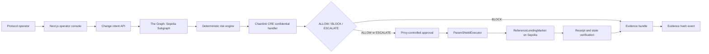
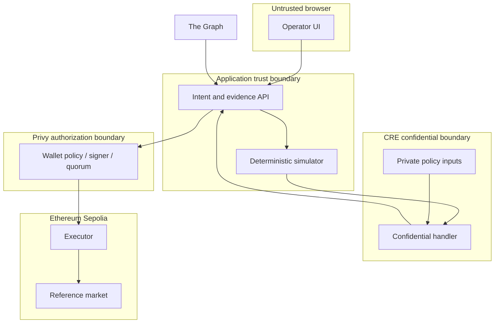

# ParamShield Architecture

**Status:** Baseline architecture  
**Date:** 2026-09-05

## System context

## Components

### Operator console

- Creates a supported change intent and renders decoded calldata.
- Displays data provenance, simulation deltas, policy result, approval state,
  receipt, final state, and downloadable evidence.
- Never decides authorization locally.

### Change intent API

- Normalizes the intent before hashing.
- Validates chain, target, selector, parameter bounds, nonce, and expiry.
- Coordinates Graph reads, deterministic simulation, CRE invocation, and
  evidence assembly.

### Sepolia Subgraph

Indexes market configuration, positions, execution lifecycle events, and
evidence hashes. Every query result records indexed block and fetch time. The API
applies a freshness policy before using it.

### Deterministic risk engine

- Uses integer/fixed-point arithmetic for calculations that influence policy.
- Computes current/proposed and normal/stressed matrices.
- Searches for the nearest safe parameter without LLM participation.
- Produces canonical output that can be hashed and replayed in tests.

### CRE confidential workflow

- Receives public intent and simulation summaries.
- Fetches private risk thresholds within the confidential handler.
- Returns only policy version, verdict, rule identifiers, recommendation, hash,
  and expiry.
- Does not emit private values in logs, reports, or calldata.

### Privy approval

- Controls the wallet that calls `ParamShieldExecutor`.
- Uses the strongest verified feature available to the event account: policy,
  scoped signer, key quorum, or manual intent review.
- Keeps application credentials and authorization private keys server-side.

### Contracts

`ReferenceLendingMarket` provides a deterministic lending model and emits all
state needed by the Subgraph. `ParamShieldExecutor` binds a signed/verified
decision to the exact proposed call, enforces expiry and replay protection, and
performs the allowlisted update. Evidence storage contains hashes or CIDs, never
private policy material.

## Canonical data flow

1. Normalize intent fields and ABI-encode the proposed market call.
2. Compute `changeHash = keccak256(canonicalIntent)`.
3. Query Graph state, verify freshness, and hash the canonical snapshot.
4. Run all four simulation cells and hash the result.
5. Send only the declared public summary into CRE; fetch private values inside
   the confidential boundary.
6. Validate the returned verdict schema and bindings.
7. For a rejected proposal, persist evidence and stop.
8. For an allowed replacement, construct the exact calldata, request Privy
   authorization, and call the executor.
9. Wait for finality, read the market parameter, and finish the evidence bundle.

## Trust boundaries

## Repository boundaries

| Path | Responsibility | Must not contain |
| --- | --- | --- |
| `apps/web` | UI and server routes | wallet secrets, hidden policy rules |
| `packages/shared` | canonical schemas and types | network calls |
| `packages/risk-engine` | deterministic calculations | LLM calls or signing |
| `packages/evidence` | canonical serialization and hashing | raw authorization secrets |
| `subgraph` | event indexing | execution authority |
| `workflows/chainlink-cre` | confidential policy evaluation | browser-only code |
| `contracts` | final enforcement and state | unbounded dynamic policy text |

## Failure behavior

The system fails closed when live data is stale, a query fails, simulation is
invalid, CRE times out or returns malformed output, a decision binding differs,
approval is insufficient, transaction submission fails, or final state cannot
be verified. The UI preserves the evidence collected up to failure and displays
which boundary stopped the flow.
