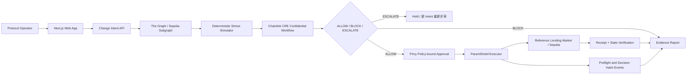

# ParamShield — 完整产品与实施计划

> - 状态：本地工作计划完整公开副本；本地工作原件继续被忽略。
> - 更新时间：2026-09-08（Asia/Shanghai）
> - ETHOnline 2026 提交截止：2026-09-14 00:00（北京时间）
> - 当前模式：Building from Scratch

## 0. 执行状态

### 2026-09-05

- [x] **T-001**：pnpm
      monorepo、Next.js、Foundry、lint、typecheck、test、build 与 GitHub
      Actions 已建立；本地 `pnpm verify` 和远程 CI 均通过。
- [x] **T-002**：三个 Sponsor 的账号路径和本地工具链已验证；The
      Graph 已用 MetaMask 登录并完成邮箱验证；Chainlink
      CRE 已完成账号登录、Sepolia 支持检查和官方 Confidential
      Workflow 本地仿真，部署权限申请等待审核；Privy 开发应用已创建，凭据仅保存于本地忽略文件，认证 SDK 读取成功。
- [x] **T-003**：产品 spec、架构、threat model、AI
      usage 与 Sponsor 验收边界已经固化并提交。
- [x] 已形成多个小而可审查的 Conventional Commits，并持续推送至 `main`。

### 2026-09-06

- [x] **T-101**：Reference Lending Market 与 mETH/mUSDC mock
      assets 已实现，支持确定性仓位和 LT 参数变更。
- [x] **T-102**：5 个 canonical seed 仓位、seed 脚本与 Foundry 测试已完成。
- [x] **T-103**：Executor 状态机已完成；对链、target、calldata、evidence、nonce 和过期时间进行绑定，并对风险路径 fail
      closed。
- [x] **T-104**：已用单笔交易部署 Sepolia bootstrap（区块
      `11645965`），记录全部 5 个合约地址、ABI、浏览器链接和链上初始状态；Sourcify
      exact-match 与 Blockscout 源码验证均通过。

### 2026-09-07

- [x] **R-01**：规则/政策/隐私/证据 DAG/计划修订；保留本地 ignore，公开完整脱敏 plan 与现有 material
      prompt 记录。
- [x] **R-02**：bigint 四组指标、机密边界可复用政策与有界搜索；7942 /
      7941 边界、absolute 无解等回归。
- [x] **R-03**：严格 v2
      schema、preflight/change/decision/final 哈希 DAG、TypeScript / Solidity
      golden vector；这只是结构完整性，不是远程真实性证明。
- [x] **R-04（本地）**：stateVersion、authorizationEpoch、角色分离、ESCALATE
      hold 与回归；未部署，不覆盖现有 Sepolia v1。
- [x] **R-05 本地备援**：本地 Graph Node 已同步真实 Sepolia
      v1 事件；5 个仓位、总量和配置均与同块 RPC 核对，保留 `graph-local`
      标记且不可执行。
- [ ] **R-05 hosted
      gate**：Studio 登录 GraphQL 返回 503；官方远端部署、v2 索引与新事件影响分析仍待完成。本地成功不等于 The
      Graph 奖项资格。
- [x] **R-06（control spike）**：Privy 隔离钱包真实签名通过，wrong
      chain/target/value/calldata 参数均由 provider
      policy 拒绝；未广播、未入金、没有 operator 权限。最终组织审批/执行仍待 R-09。
- [x] **R-07 产品预览**：真实 CRE CLI/WASM 接入 fresh local Graph；运行时 demo
      secret 驱动政策与搜索，7000 BLOCK、推荐 7942、独立重审 ALLOW；均
      `executable: false`，不是硬件 TEE。
- [x] **签名前校验准备**：增加 v2
      bytecode/角色/state/epoch/链上 ALLOWED/decisionHash/持久人工复核/过期/reorg 等本地测试；只生成精确 unsigned
      call，未接真实 RPC/审核存储适配器，未签名广播。
- [x] **本地验证**：`pnpm verify`
      全部通过，共 120 项测试；Graph/CRE 真实本地联调另存公开脱敏证据。
- [ ] **R-07 执行 relay 与 R-08 至 R-13**：真实 v2/hosted
      Graph、Privy 最终控制/身份与审核适配、完整端到端、AI、复演、视频、正式提交仍待完成。

### 2026-09-08

- [x] **R-08 已部署**：用户明确批准分工 → 预演 → 审阅并发送 v2。32 项合约测试与 Sepolia
      dry-run 通过；MetaMask 单笔创建，区块 11660450，交易
      `0x94bc330ac8eb839bd2eabb8ff907143a169f567b9c9fdbfb48b82d17f08233a6`。新 manifest：`deployments/sepolia-v2.json`，同块角色/epoch/stateVersion/5 仓位/余额/字节码已核验；v1 不变，Privy 保持 DENY。
- [x] **Privy 候选初始准备（部署前）**：另建独立、未入金的 operator 候选钱包，初始 wildcard
      DENY；provider 实际读回绑定并拒绝 Sepolia 签名请求。该初始证据尚无链上角色；后续已在 v2 部署中分配 operator，仍保持锁定。没有复用隔离 proof 钱包或导入 MetaMask 私钥。历史证据见
      `docs/evidence/privy-operator-candidate-2026-09-08.json`。
- [ ] **角色剩余 gate**：已确认分工并完成 v2 部署；authority /
      reviewer 身份与签名能力、最终 operator 精确策略和 hosted
      v2 仍待完成，不能将锁定部署标为完整受控执行。
- [x] **Studio 恢复与 hosted
      v1**：用户确认连接条款后，使用原参赛钱包登录，创建并部署
      `paramshield-sepolia-v-1` / `v0.1.0`。Studio 显示 DEPLOYED / SYNCED /
      100%；正式托管端点的 5 个仓位、配置与总量在区块 11660066 与同块 RPC 核对通过，校验时区块年龄 8 秒、落后 0 块。已接入只读风险计算，不是本地 fixture。
- [ ] **Graph 剩余 gate**：当前是有每日 3,000 次查询限制的 Studio development
      endpoint，未 publish 到 The Graph
      Network；v2 索引、新事件改变分析、运行时 AI 与参赛验收仍待完成，不把 hosted
      v1 当作可执行 v2。
- [x] **R-08 部署准备**：单独 BootstrapV2、角色分离测试、Sepolia
      dry-run 脚本、候选 ABI、源码哈希与只读预算就绪。旧 v1 manifest /
      ABI 保留；后续经用户明确确认，v2 已在区块 11660450 部署并配置分离角色，Privy 保持 DENY。
- [x] **真实适配器**：同块 RPC 的代码/角色/版本/epoch/ALLOWED 检查；EIP-712 身份恢复与持久审核存储，拒绝自审、篡改、过期和覆盖。
- [x] **CRE / 签名 relay**：真实 CLI execution
      lane、owned-run 来源约束、实际 nonce/gas/balance 读取、精确交易校验、持久幂等/nonce 保留、超时 UNKNOWN 和状态变化 QUARANTINED。只签名，不含 broadcaster。
- [x] **实际分层联调**：Anvil-only 的 CRE BLOCK /
      ALLOW、签名审核与 epoch 轮换阻断；独立 Privy 隔离钱包 v2
      tuple 签名成功，13 项 provider
      policy 拒绝。两项证据分开记录，均不声称真实 hosted Graph → Privy →
      Sepolia 端到端。
- [ ] **后续真实执行**：hosted
      v1 已接通；v2 部署与角色配置已完成；对应 hosted 索引、authority /
      reviewer 身份流程、真实人工审核、propose / decision /
      execute 交易与 receipt + state 证据仍待完成。部署交易不等于受控执行。
- [x] **本地验证**：格式/lint/types/production
      build 通过；并行测试的两项默认超时在串行全量回归中消除，保持默认测试时限，共 150 项通过。Privy
      / Anvil 证据与源码哈希核对通过。
- 验证结果见 `docs/execution-service.md` 和 `docs/implementation-plan.md`。

## 1. 产品定义

### 1.1 名称

**ParamShield**

### 1.2 一句话定位

> Preflight risk checks for DeFi protocol parameter changes.

ParamShield 在协议参数变更进入多签并执行前，使用实时仓位、压力测试和机密风控政策判断变更是否安全；危险交易被阻断，安全替代参数经过组织级审批后在链上执行。

### 1.3 产品类比

- DeFi 协议的 CI/CD 安全门禁。
- 面向 Risk Council、DAO 多签和协议运营团队的 preflight control plane。
- 不是风险 Dashboard，也不是拥有无限权限的 AI 交易机器人。

### 1.4 核心承诺

对于一笔待执行的协议参数交易，ParamShield 必须回答并证明：

1. 这笔交易会影响哪些仓位？
2. 当前状态和压力情景下会产生多少即时清算、风险债务或潜在坏账？
3. 它违反了哪条风险政策？
4. 应当 `ALLOW`、`BLOCK` 还是 `ESCALATE`？
5. 如果不安全，满足约束的最近安全参数是什么？
6. 谁批准了最终交易，链上实际执行了什么？

## 2. 目标与成功标准

### 2.1 Hackathon 目标

- 完成一个可复现的端到端风险门禁流程，而不是堆积多个浅层功能。
- 形成一条不可拆分的 Sponsor 链路：
  - **The Graph**：提供实时仓位和参数历史。
  - **Chainlink CRE Confidential
    Workflow**：机密 handler 执行政策/搜索；P0 使用 CLI 仿真，不声称硬件 TEE。
  - **Privy**：提供组织钱包、Signer/Policy/Quorum 或 Intent 驱动的受控执行。
- 提交一个公开、可运行、提交历史可信的仓库。
- 制作 2–4 分钟、不使用 AI 配音的清晰 Demo 视频。

### 2.2 产品成功标准

主 Demo 必须真实完成：

1. 创建一笔参数变更意图。
2. 从 The Graph 的实时端点取得仓位数据。
3. 运行确定性的 Before/After 压力测试。
4. 通过 CRE Confidential Workflow 处理至少一个机密输入。
5. 对危险交易返回 `BLOCK`，并使其无法进入执行路径。
6. 计算一个满足约束的安全替代参数。
7. 通过 Privy 控制完成审批。
8. 在 Sepolia 上执行真实交易。
9. 生成可下载、可哈希验证的 Evidence Bundle。

### 2.3 Demo 成功指标

- 一眼可理解：评委在 20 秒内理解“参数变更执行前风险门禁”。
- 可量化：页面显示受影响仓位数、受影响债务、压力可清算债务增量和安全参数。
- 可验证：所有关键结论都能追溯到 Graph 查询、CRE 输出、仿真结果或交易哈希。
- 可失败：主动展示危险交易被拒绝，而不只是成功路径。
- 可恢复：展示修改为安全参数后成功批准和执行。

## 3. 用户与核心任务

### 3.1 首要用户

- DeFi 协议 Risk Council。
- DAO 多签签名人。
- 协议参数管理员和风险运营人员。
- 负责借贷市场、Vault 或稳定币系统的工程/运营团队。

### 3.2 首要 Job-to-be-Done

> 当我收到一笔协议参数变更交易时，我需要在签名前知道它对当前用户仓位和极端市场情景的真实影响，以便阻止危险操作并留下完整审计证据。

### 3.3 非目标用户

- 普通散户交易者。
- 追求收益最大化的自动交易 Agent。
- 只需要价格提醒的用户。

## 4. 主 Demo 场景

### 4.1 场景：降低清算阈值导致意外清算

Reference Lending Market 中存在一批不同健康度的 ETH 抵押 / USDC 借款仓位。

初始参数：

- Liquidation Threshold：80%。
- 操作者提出的新值：70%。
- 私密政策示例：
  - 单次 LT 下调不得超过 3 个百分点。
  - 参数变更不得让任何当前健康仓位立即变为可清算。
  - 相对同一快照、当前参数基线的新增压力可清算债务不得超过总债务的 2%；基线风险单列，不代表整个市场安全。
  - 超限必须返回 `BLOCK` 或 `ESCALATE`。

期望结果：

1. Graph 返回实时仓位。
2. 仿真发现 70% 会使若干仓位立即进入清算区间。
3. CRE 机密政策返回 `BLOCK`。
4. ParamShield 计算最近的安全值，fixture 中为 79.42%（由实时数据和机密政策内有界搜索得出，不能硬编码；79.41% 不通过）。
5. 操作者改用建议值。
6. Privy 审批后调用测试网合约完成参数更新。
7. Evidence Bundle 显示危险方案与安全方案的 Before/After 差异。

### 4.2 压力情景

主场景只支持一个确定性冲击：

- ETH 价格瞬时下跌 15%。
- USDC 债务价格保持 1 美元。
- 计算所有仓位冲击后的 Health
  Factor、可清算债务和简单抵押短缺（不是实际坏账，未含滑点/成本）。

### 4.3 历史回放

P1 延后功能，不进入本周 P0：可以回放 **Aave V2 CRV 风险参数/流动性事件**。

- 首选参考：Aave AIP-92 对 CRV Liquidation
  Threshold 的逐步调整；公开说明明确检查参数更新不会导致账户被清算。
- 扩展参考：2022-11-22 Aave V2
  CRV 市场事件，约 6300 万美元抵押被清算并留下约 170 万美元坏账。
- 回放必须标记为 counterfactual
  simulation，不能宣称单一参数一定可以完全阻止历史事件。
- 若历史区块数据接入耗时过高，保留可复现数据集和来源链接，不阻塞主 Demo。

参考资料：

- https://governance-v2.aave.com/governance/proposal/92/
- https://governance.aave.com/t/q4-2022-risk-off-measures/10898

## 5. 范围管理

### 5.1 P0 — 必须完成

- [ ] Reference Lending Market 合约及测试。
- [ ] Mock ETH / USDC 测试资产与可复现仓位种子。
- [ ] Liquidation Threshold 参数变更。
- [ ] ETH -15% 压力情景。
- [ ] The Graph Sepolia Subgraph 与实时查询。
- [ ] 参数变更影响计算。
- [ ] 最近安全参数推荐。
- [ ] CRE `handlerInTee` / 等价机密处理器。
- [ ] `ALLOW / BLOCK / ESCALATE` 结构化输出。
- [ ] 危险变更在合约执行层 fail closed。
- [ ] Privy 钱包与至少一种 Policy/Signer/Quorum/Intent 控制。
- [ ] 安全参数真实 Sepolia 交易。
- [ ] Evidence Bundle 与哈希校验。
- [ ] 一个控制台与持久时间线，覆盖创建、分析、阻断、审批和执行。
- [ ] P0：基于 live Graph 与证据字段的 AI 风险解释/问答。
- [ ] P0：超时、过期、重复提交、状态恢复、审批期间状态变化失效、可重复 Demo。
- [ ] Foundry、单元、集成和关键 E2E 测试。
- [ ] 英文 README、架构图、AI 使用披露和运行说明。
- [ ] 2–4 分钟 Demo 视频。

### 5.2 P1 — 主流程稳定后完成

- [ ] Aave 历史事件回放。
- [ ] AI 比较两个候选安全参数，但最终结果必须经过确定性规则验证。
- [ ] Evidence Bundle 上传 IPFS，并将 CID/哈希写入链上事件。
- [ ] 更精细的受影响仓位可视化。

### 5.3 P2 — 仅作为路线图

- 第二种风险情景：预言机价格偏差或稳定币脱锚。
- 多资产、多借贷池。
- Aave/Compound/Morpho 等真实协议适配器。
- Governance proposal 与 Safe Transaction Service 接入。
- 参数变更后的持续监控与自动回滚。
- 通用 Runbook DSL/Marketplace。
- 多链部署。

### 5.4 明确不做

- 不做交易策略和收益优化。
- 不让 LLM 直接持有管理员密钥或绕过 Policy。
- 不做泛化的“AI 风险评分 Dashboard”。
- 不同时接入超过三个 Sponsor。
- 不使用静态假数据冒充 The Graph 实时数据。
- 不为了 Demo 伪造交易哈希、CRE 结果或审批记录。

## 6. 功能需求

### FR-01 创建变更意图

操作者输入或导入：

- Chain ID。
- Target contract。
- Function selector / calldata。
- 当前参数与建议参数。
- 变更说明。
- 有效期和 nonce。

系统生成唯一 `changeId` 和规范化 `changeHash`。

### FR-02 解码与校验

- 只允许支持列表中的目标合约和函数。
- 校验 calldata 与 UI 展示的参数一致。
- 拒绝未知 selector、错误 chainId、过期请求和 nonce 重放。

### FR-03 获取实时状态

- 从 Graph Gateway/Studio 查询市场参数、仓位和最近参数事件。
- 展示数据源、GraphQL 查询、区块号和获取时间。
- 数据过期时 fail closed，不允许继续执行。

### FR-04 运行仿真

同时计算：

- Current configuration + current price。
- Proposed configuration + current price。
- Current configuration + stress price。
- Proposed configuration + stress price。

输出：

- 立即新增可清算仓位。
- 当前和压力情景可清算债务。
- 最低/中位 Health Factor。
- 简单抵押短缺（不是实际坏账，未含滑点/成本）。
- 参数变化幅度。

### FR-05 机密政策判断

CRE 工作流读取：

- 公开：变更意图、Graph 状态摘要、仿真摘要。
- 私密：从 secret 加载的政策阈值、必要 API 凭证；公开 fixture 参数不属于真实生产机密。
- 在机密 handler 内重新计算完整快照，并完成政策评估与候选搜索；不能相信浏览器传入指标。
- P0 选择 CRE CLI simulation + trusted
  relay，明确不是硬件 TEE 或链上 attestation。

返回严格 JSON：

```json
{
  "changeId": "0x...",
  "verdict": "BLOCK",
  "policyVersion": "incremental-exposure-v2",
  "violations": ["MAX_LT_DELTA", "ZERO_NEW_LIQUIDATIONS"],
  "recommendedValueBps": 7942,
  "evidenceHash": "0x...",
  "expiresAt": 0
}
```

### FR-06 推荐安全参数

- 仅支持下调，在 [proposal,
  current] 中有界逐 bp 枚举（最多 4,501）；整个评估/搜索留在机密 handler 内。
- 每个候选值必须重新运行确定性仿真。
- AI 仅解释证据，不能选择可执行参数或绕过硬约束。
- 当前值本身通过但无有效变更时返回 NO_CHANGE；原 absolute
  2% 政策无解必须 NO_SAFE_VALUE。
- 找不到安全值时返回 `NO_SAFE_VALUE`。

### FR-07 执行门禁

- `BLOCK`：合约层禁止执行。
- `ESCALATE`：保持 hold；重新评审必须创建新 nonce、新快照和新 decision，不能普通审批后执行原 intent。
- `ALLOW`：仍需通过对应 Privy 控制后方可执行。
- Verdict 绑定完整 v2 intent；增加 market stateVersion 与 executor
  authorizationEpoch。任何风险状态变化或角色/allowlist 轮换令旧 intent 失效。
- Privy
  operator 与 decisionAuthority 必须不同；治理 admin 仍被信任，不宣传 admin-proof。

### FR-08 审批与执行

- Privy 组织/应用钱包提交待审批交易。
- UI 显示审批者、阈值、状态和时间。
- 审批完成后调用 ParamShield Executor。
- 等待 receipt，重新读取合约参数确认结果。
- 只有链上状态已变化时才能显示 `EXECUTED`。

### FR-09 Evidence Bundle

生成规范化 JSON，至少包含：

- 事件时间与版本。
- change intent 与 calldata。
- Graph 查询、区块号和数据哈希。
- 仿真输入、输出和算法版本。
- CRE workflow run ID、输出和证明/日志。
- 命中的政策和 verdict。
- 推荐参数及公开算法版本；不包含私密阈值或完整候选搜索轨迹。
- Privy 审批状态。
- Sepolia 交易哈希和 receipt。
- Before/After 状态。

依赖 DAG：intentCore + snapshot + simulation -> preflightHash -> changeHash ->
decisionHash -> receipt ->
finalBundleHash。链上 evidenceHash 指 preflightHash；最终包引用链上 preflight/decision，自己的 hash 不冒称已在执行前上链。IPFS 为 P1。

## 7. 非功能与安全要求

### 7.1 安全不变量

- LLM 永远不能直接签名或发送管理员交易。
- 未收到有效 verdict 时默认拒绝执行。
- Graph 数据过期、CRE 超时、签名异常或仿真失败时默认拒绝。
- UI 参数必须与实际 calldata 完全一致。
- Verdict 不可跨 chain、target、calldata 或 nonce 重用。
- 交易执行后必须通过 receipt 和合约读取双重确认。
- 所有私钥和服务密钥仅存在于服务端环境变量。
- `.env*`、部署私钥和本地广播文件不得提交。

### 7.2 性能目标

- Graph 查询：目标小于 3 秒。
- 本地风险计算：目标小于 2 秒。
- 完整判断：目标小于 20 秒（CRE 网络延迟单独展示）。
- 页面首次可交互：目标小于 3 秒。

### 7.3 可用性

- 支持桌面端 1280px 以上 Demo。
- 每一步都显示当前状态、数据来源和失败原因。
- 不使用只能通过颜色识别的风险状态。
- Demo 模式不得把 seed data 标成 live data。

## 8. 技术架构



### 8.1 建议技术栈

- Monorepo：pnpm workspaces。
- Web：Next.js + TypeScript + Tailwind CSS。
- Contracts：Solidity + Foundry。
- Chain：Ethereum Sepolia。
- Indexing：The Graph Subgraph Studio/Gateway。
- Confidential decision：Chainlink CRE TypeScript workflow。
- Wallet/approval：Privy。
- Testing：Foundry、Vitest、Playwright。
- Schema validation：Zod。
- Canonical JSON/hash：RFC 8785 风格稳定序列化 + keccak256。

### 8.2 建议目录

```text
paramshield/
├── apps/
│   └── web/
├── contracts/
│   ├── src/
│   ├── script/
│   └── test/
├── subgraph/
├── packages/
│   ├── risk-engine/
│   ├── evidence/
│   ├── shared/
│   └── sdk/
├── workflows/
│   └── chainlink-cre/
├── scripts/
│   ├── seed-market/
│   └── replay/
├── tests/
│   └── e2e/
├── docs/
│   ├── architecture.md
│   ├── threat-model.md
│   ├── ai-usage.md
│   ├── demo-script.md
│   └── submission-checklist.md
└── README.md
```

## 9. 合约设计

### 9.1 `ReferenceLendingMarket.sol`

最低功能：

- ETH 类抵押资产与 USDC 类债务资产。
- `supplyCollateral`、`borrow`、`repay`。
- `getPosition`、`healthFactor`。
- `liquidationThresholdBps` 风险参数。
- 仅 ParamShield Executor 可调用的参数更新接口。
- 发出仓位和参数变化事件供 Subgraph 索引。

### 9.2 `ParamShieldExecutor.sol`

- 接收参数变更 intent。
- 保存 changeHash、状态、nonce、expiry。
- 验证独立 decisionAuthority 调用（P0 为 trusted relay，不是报告/TEE
  attestation 验证器）。
- 校验 target 和 selector allowlist。
- 阻止 `BLOCK`、过期、重放、证据不匹配的执行。
- 经批准后调用 Lending Market。
- 发出
  `ProposalCreated`、`ProposalPreconditions`、`DecisionRecorded`、`ProposalExecuted`、`ProposalMarkedExpired`
  等实际事件。

### 9.3 `EvidenceRegistry.sol`（可合并）

- 只保存 evidenceHash/CID、changeId 和状态，不保存敏感原文。
- 链上记录必须能与下载的 Evidence Bundle 做哈希核对。

## 10. 风险计算模型

### 10.1 Health Factor

```text
HF = collateralValue × liquidationThreshold / debtValue
```

- `HF < 1`：可清算。
- 修改 LT 后重新计算全部仓位。
- 压力情景先调整 collateral price，再重新计算。

### 10.2 基础指标

- `newlyLiquidatablePositions`
- `newlyLiquidatableDebtUsd`
- `stressedLiquidatableDebtUsd`
- `collateralShortfallUsdE18`
- `parameterDeltaBps`
- `minHealthFactorBefore/After`
- `medianHealthFactorBefore/After`

### 10.3 安全参数搜索

1. 确认参数允许区间；P0 位置数 × 候选数上限 50,000，超出默认停止。
2. 固定下调区间为 [proposal, current]。
3. 在机密边界内逐 bp 枚举最近通过值，所有指标重算。
4. 只发布推荐值和公开指标；不发布逐候选结果，以免泄露私密阈值。
5. 搜索不准超出 current 来抬高 LT 掩盖风险，不由 AI 猜测。

## 11. AI 使用边界

### 11.1 AI 可以做

- 将风险指标解释为面向多签人的简短结论。
- 识别变化最显著的仓位和风险因子。
- 比较经过确定性仿真验证的候选参数。
- 生成风险摘要、问题列表和 Demo 叙述。

### 11.2 AI 不可以做

- 修改硬约束。
- 直接决定未经验证的安全参数。
- 签署或发送交易。
- 在数据缺失时虚构指标。
- 将模型置信度替代链上证据。

### 11.3 提交披露

- 建立 `docs/ai-usage.md`。
- 记录使用的模型、用途、人工复核方式和受影响文件。
- 若采用 spec-driven workflow，提交前公开所需 spec、prompt 和规划材料。

## 12. Sponsor 验收标准

### 12.1 The Graph

目标：Best AI Tooling or AI Use Case with The Graph (From
Scratch)。自定义单一 Subgraph 不等于标准化/可组合赛道资格；加入 P0 证据式风险问答。

- [ ] 使用 Graph Provider 的 live data，不使用本地静态 JSON 冒充。
- [ ] 查询结果直接进入仿真和 verdict。
- [ ] 展示 API key 安全处理。
- [ ] README 给出 Subgraph、查询示例和部署地址。
- [ ] 公共仓库与 2–4 分钟视频。

### 12.2 Chainlink

- [ ] 使用 CRE Confidential Workflow。
- [ ] 注册并调用 TEE handler。
- [ ] 至少处理一个真实的私密阈值、secret 或 API 凭证。
- [ ] 机密输出参与核心风险门禁。
- [ ] 提供 CRE CLI simulation 或 live deployment 证据。
- [ ] 不额外加入独立 Liquidation Protection Challenge，不扩范围。

### 12.3 Privy

- [ ] Privy 是执行权限的核心组成，不只是登录。
- [ ] 创建或使用至少一个 Privy wallet。
- [ ] 实现真实 B2B/组织参数审批流程。
- [ ] 使用至少一种 Privy control：Policy、Signer、Key Quorum 或 Intent。
- [ ] 完成一个真实测试网状态变更。

## 13. 页面与交互

### 13.1 页面

一个 Operator Console + Timeline，分区展示 Overview、New
Change、Analysis、Decision、Approval、Execution、Evidence，不做七个独立页面。

### 13.2 状态机

```text
DRAFT
  -> DATA_READY
  -> SIMULATED
  -> ALLOWED (BLOCKED / ESCALATED 终止该 intent)
  -> APPROVAL_PENDING
  -> APPROVED
  -> SUBMITTED
  -> EXECUTED | FAILED | EXPIRED
```

页面必须基于后端/链上真实状态显示，不能仅靠前端按钮跳转。

## 14. 测试计划

### 14.1 合约测试

- 正常提交、批准与执行。
- `BLOCK` verdict 无法执行。
- 未知 target/selector 被拒绝。
- calldata 与 changeHash 不一致被拒绝。
- verdict 过期被拒绝。
- nonce 重放被拒绝。
- 未授权 signer/verdict 被拒绝。
- 执行失败不标记成功。
- evidenceHash 与事件一致。

### 14.2 风险引擎测试

- HF 边界：小于、等于、大于 1。
- 零债务、零价格、极大数值和 rounding。
- LT 下调后的新增清算仓位。
- -15% 压力情景。
- 推荐参数满足全部策略。
- 无安全参数时 fail closed。
- 相同输入得到相同输出和相同 hash。

### 14.3 集成测试

- Graph 最新数据进入 risk engine。
- Graph 超时/过期时阻止流程。
- CRE 成功、超时、无效 JSON 和签名异常。
- Privy 拒绝、批准和 quorum 不足。
- Sepolia receipt 与最终参数读取一致。

### 14.4 E2E

- 危险参数完整阻断路径。
- 安全替代参数完整执行路径。
- Evidence Bundle 下载和哈希验证。
- Demo 使用的固定浏览器尺寸与网络条件。

## 15. 实施任务与依赖

### Phase 0 — 风险验证与骨架

- **T-001** 初始化 pnpm monorepo、lint、typecheck、test。
  - 依赖：无。
  - 验收：本地和 CI 一条命令通过。
- **T-002** 验证 The Graph、CRE、Privy 所需账号、权限和测试网支持。
  - 依赖：无。
  - 验收：保存最小成功调用日志，不提交密钥。
- **T-003** 固化 spec、架构、threat model、AI usage 模板。
  - 依赖：无。
  - 验收：P0 范围和验收项无歧义。

### Phase 1 — 可控市场与执行层

- **T-101** 实现 Mock Tokens 和 Reference Lending Market。
  - 依赖：T-001。
  - 验收：可创建不同 HF 的仓位并修改 LT。
- **T-102** 编写 Foundry 单元测试和 seed 脚本。
  - 依赖：T-101。
  - 验收：固定 seed 每次生成相同仓位结果。
- **T-103** 实现 ParamShield Executor 和状态机。
  - 依赖：T-101。
  - 验收：危险、过期、重放和错误 calldata 都被合约拒绝。
- **T-104** 部署至 Sepolia 并验证合约。
  - 依赖：T-102、T-103。
  - 验收：保存地址、部署区块、浏览器链接和 ABI。

### Phase 2 — 数据与风险计算

- **T-201** 建立 Subgraph schema/mappings。
  - 依赖：T-101。
  - 验收：索引仓位、参数和执行事件。
- **T-202** 部署 Subgraph 并查询 live data。
  - 依赖：T-104、T-201。
  - 验收：Graph Gateway 返回刚生成的测试网事件。
- **T-203** 实现确定性 risk engine。
  - 依赖：T-101。
  - 验收：四组 Before/After 指标测试通过。
- **T-204** 实现安全参数搜索。
  - 依赖：T-203。
  - 验收：推荐值通过全部硬约束且不是硬编码。

### Phase 3 — Confidential Decision

- **T-301** 定义 policy schema 和版本化策略。
  - 依赖：T-203。
  - 验收：策略可验证、可哈希，明确公开/私密字段。
- **T-302** 实现 CRE Confidential Workflow。
  - 依赖：T-002、T-202、T-301。
  - 验收：TEE handler 读取 secret 并输出严格 verdict JSON。
- **T-303** 连接 verdict 与 Executor。
  - 依赖：T-103、T-302。
  - 验收：真实 CRE 结果能允许或阻止对应 changeHash。

### Phase 4 — Privy 审批

- **T-401** 创建 Privy wallet 和最小组织审批流程。
  - 依赖：T-002。
  - 验收：至少一种官方 control 可实际运行。
- **T-402** 将 Privy signer/quorum 连接 Executor。
  - 依赖：T-303、T-401。
  - 验收：quorum 不足不能执行，通过后可以发送 Sepolia 交易。
- **T-403** 完成链上状态回读和交易验证。
  - 依赖：T-402。
  - 验收：receipt 成功且参数读取等于批准值。

### Phase 5 — Web 与证据

- **T-501** 实现创建变更和 calldata 校验页面。
  - 依赖：T-103。
  - 验收：展示内容与编码数据一致。
- **T-502** 实现分析、政策和推荐页面。
  - 依赖：T-202、T-204、T-302。
  - 验收：每个数值可以展开查看来源。
- **T-503** 实现审批、执行和状态时间线。
  - 依赖：T-402、T-403。
  - 验收：刷新页面后仍能从真实状态恢复。
- **T-504** 实现 Evidence Bundle。
  - 依赖：T-303、T-403。
  - 验收：preflight 与 decision
    hash 对应链上事件；最终包引用 receipt 并独立验证，不能循环哈希。
- **T-505** 接入受约束的 AI 风险解释。
  - 依赖：T-204、T-301。
  - 验收：解释只引用 evidence 中存在的数据，失败时不伪造文本。

### Phase 6 — 提交（历史回放延后）

- **T-601 / P1 延后** 完成 Aave 历史数据最小回放。
  - 依赖：T-203。
  - 验收：来源、区块/时间和反事实假设明确。
- **T-602** 部署 Web Demo。
  - 依赖：T-501 至 T-505。
  - 验收：干净浏览器可访问，主路径可重复三次。
- **T-603** 运行完整回归与安全检查。
  - 依赖：全部 P0。
  - 验收：lint、typecheck、unit、integration、E2E 全部通过。
- **T-604** 完成公开文档和 Sponsor 对照表。
  - 依赖：T-603。
  - 验收：评委可在 10 分钟内从 README 复现核心流程。
- **T-605** 录制 2–4 分钟视频并填写提交。
  - 依赖：T-602 至 T-604。
  - 验收：720p 以上、真人讲解、无加速、时长合规。

## 16. 关键路径

```text
T-002 权限验证
   ├── T-202 Graph live data
   ├── T-302 CRE confidential workflow
   └── T-401 Privy control

T-101 Market
   -> T-103 Executor
   -> T-104 Sepolia deploy
   -> T-202 Subgraph
   -> T-203 Simulation
   -> T-302 CRE
   -> T-303 Verdict gate
   -> T-402 Privy execution
   -> T-504 Evidence
   -> T-602 Demo
```

最早验证 T-002。若任一 Sponsor 的权限或测试网功能不可用，必须在 UI 开发前发现。

## 17. 时间表

### 9 月 5 日

- 固化计划、spec、架构与 repo 骨架。
- 完成三个 Sponsor 的最小权限/SDK spike。
- 建立连续、可审查的 Git 历史。

### 9 月 6 日

- Reference Lending Market、Executor、Foundry 测试。
- Sepolia 首次部署和 seed 仓位。

### 9 月 7 日

- 修订 policy 回归、证据 DAG、v2 状态/权限 epoch 约束。
- 完成 live Graph 数据与真正 Privy
  wallet/control 提前验证（SDK 读取不等于集成完成）。

### 9 月 8 日

- 固化 risk engine / search / evidence 接口。
- 产品 CRE handler + trusted relay 路径；准备 v2 部署审阅，不自动替换既有部署。

### 9 月 9–10 日

- 首次完整 BLOCK -> 新 intent 重算/新决策 -> Privy -> 真实 Sepolia 执行。
- 一个控制台、持久时间线、最小证据式 AI 解释。

### 9 月 11 日

- 功能冻结、失败路径回归、幂等/超时/过期、Demo reset 与三次复演。

### 9 月 12 日

- 所有公开 spec/prompts/planning artifacts、文档、视频与提交材料就绪。

### 9 月 13 日

- 白天完成提交；晚上只作为恢复/重录缓冲。
- 硬截止仍是北京时间 9 月 14 日 00:00。

## 18. Demo 视频脚本

### 0:00–0:20 — 问题

协议参数通常由运营团队直接进入多签；权限验证了“谁能改”，却没有验证“现在这样改是否安全”。

### 0:20–0:50 — 创建危险交易

展示 LT 从 80% 降至 70% 的真实 calldata 和待签交易。

### 0:50–1:25 — 实时状态

展示 The Graph 返回的仓位、区块号和数据新鲜度。

### 1:25–2:05 — 仿真与机密决策

展示新增可清算仓位、债务和 -15% 情景；CRE 返回 `BLOCK` 及违规规则。

### 2:05–2:35 — 安全替代参数

展示 79.42% 等实时计算结果（仅为 canonical
fixture 预期），并证明它满足全部硬约束。

### 2:35–3:15 — 审批与执行

通过 Privy 审批，发送 Sepolia 交易并读取新参数。

### 3:15–3:45 — 证据

打开 Evidence Bundle，核对 Graph、CRE、Privy、交易哈希和 Before/After。

### 3:45–4:00 — 价值

“ParamShield turns protocol parameter changes from blind multisig signing into
evidence-backed, policy-bound execution.”

## 19. 提交清单

- [ ] Public GitHub repository。
- [ ] 多次、语义清晰的提交历史；不得最后一天单一大提交。
- [ ] README 的问题、方案、架构、运行与测试说明。
- [ ] Sepolia 合约地址与 explorer 链接。
- [ ] Subgraph 地址与示例查询。
- [ ] CRE workflow 代码及 simulation/deployment 证据。
- [ ] Privy 核心集成说明。
- [ ] Threat model 和已知限制。
- [ ] AI 使用范围、模型、prompt/spec 披露。
- [ ] 2–4 分钟视频，720p 以上，不使用 AI 配音或加速。
- [ ] Live demo URL。
- [ ] The Graph、Chainlink、Privy 三个 Partner Prize 表单内容。
- [ ] 所有页面、链接、测试网余额和 Demo 账号最终检查。
- [ ] 9 月 13 日白天提交，预留晚上缓冲。

## 20. 风险与降级方案

| 风险                              | 影响         | 处理                                                                                     |
| --------------------------------- | ------------ | ---------------------------------------------------------------------------------------- |
| CRE live deployment 不稳定        | 核心门禁中断 | P0 保证 CRE CLI simulation 可复现并保存完整证据；产品仍 fail closed                      |
| Privy 高级 quorum 权限不可用      | 审批流程受阻 | 立即验证；优先使用可用的 Policy/Signer/Intent，必要时用合约多签补充但不伪称 Privy quorum |
| Graph indexing 延迟               | 数据不新鲜   | UI 显示 indexed block；超出 freshness threshold 时阻止执行                               |
| 历史数据工作量过大                | 延误主流程   | 历史回放降为 P1，绝不阻塞主 Demo                                                         |
| Reference Market 被认为过于玩具化 | 实用性得分低 | 使用真实风控公式、真实 calldata、Sepolia 状态和 Aave 参数治理资料；明确 adapter 路线     |
| AI 推荐错误                       | 安全风险     | 所有推荐值必须重新经过确定性仿真和政策验证                                               |
| 前端状态伪成功                    | 信任受损     | 只以 receipt + 合约回读确认执行完成                                                      |
| Sponsor 集成显得生硬              | 奖项资格风险 | 在 README 明确说明移除任一集成会破坏哪项核心能力                                         |

## 21. Definition of Done

只有同时满足以下条件，项目才算完成：

1. 全新浏览器打开线上 Demo 可以完成完整流程。
2. 危险 LT 变更在链上执行层确实失败或无法获得可执行状态。
3. 推荐参数来自实时数据和确定性搜索，不是硬编码。
4. CRE Confidential Workflow 真实处理 secret/私密政策并有可验证日志。
5. Privy 真实参与授权和 Sepolia 交易。
6. Graph 数据直接影响 verdict。
7. Sepolia 参数变化可以从 explorer 和合约读取验证。
8. Evidence Bundle 可以下载并验证链上 hash。
9. 自动化测试覆盖主成功路径与主要失败路径。
10. README、AI disclosure、threat model、架构图和 Sponsor qualification 完整。
11. Demo 视频在四分钟内清晰展示阻断和安全执行两个路径。
12. 项目在提交截止前完成并留有恢复/重录时间。

## 22. 本地计划文件的发布策略

本地 `PLAN.md` 继续由 `.gitignore` 排除；经用户同意，把本计划完整脱敏副本发布为
`docs/planning/PLAN.md`，执行表为
`docs/implementation-plan.md`。不得仅用短摘要替代实际使用的完整规划材料。每次公开前检查秘密与个人信息；材料覆盖范围与历史 prompt 缺口写入
`docs/planning/README.md`，不伪造丢失的原始聊天记录。

## 23. 2026-09-07 审阅结论与执行入口

- 权威修订：`docs/decisions/0001-risk-and-execution-boundaries.md` 与
  `docs/product-spec.md`。
- 逐项依赖/验收/状态：`docs/implementation-plan.md` R-01 至 R-13。
- T-002 已完成的是账号/SDK readiness；live Graph、产品 CRE、Privy
  control、真实受控交易各自验收。
- Sepolia
  2026-09-06 部署是 v1；本地 v2 测试不代表 v2 已在链上，不覆盖旧 manifest/ABI。
- 旧资料中笼统的“安全”均指声明模型/政策下的参数合规，不代表整个市场安全。

## 24. 2026-09-07 Studio 故障后的执行分支

1. 用户要求分析连接问题和备选方案后，确认依次执行并要求继续。
2. 已采用本地 Graph Node，未重装钱包、更换参赛账号或绕过 TLS；远端 API
   503 与钱包余额无直接因果证据。该诊断只覆盖本机访问路径，不宣称全球故障。
3. 本地真实索引和产品 CRE CLI 预览已打通；public demo
   policy 通过运行时 secret 注入，不把这些公开数值伪称为私密生产政策。
4. 现有 Sepolia
   v1 地址和 ABI 未变；Privy 隔离钱包没有新增资金/角色，未发送交易。
5. Studio 仍是提交主路线；恢复后再完成 hosted
   gate。Goldsky 只是条件性备选，未创建新账号，也未确认其奖项适用性。
6. 下一执行入口：审阅 v2 部署与角色/资金/字节码清单，接 hosted
   Graph，补真实审核/RPC 适配和最终 Privy 控制后，才进入首次受控执行。不得把纯校验函数和模拟结果描述为已经完成组织审批或真实交易。

## 25. 2026-09-09 执行状态

- 独立 hosted v2 子图 v0.2.1 已部署；5 个仓位、总额、参数、stateVersion、executor 角色/epoch/allowlist 已按固定区块核验，v1 未变。
- 实际 hosted v2 数据进入实际 CRE CLI：7000 BLOCK，独立新意图 7942 ALLOW。CLI 不是硬件 TEE，分析不是执行。
- 本机受保护控制台已实现：真人 EIP-712 审核、Privy 精确 propose/execute、签后恢复 DENY、独立 authority、持久 nonce/交易日志、真实回执与事件核验、Graph 执行后事件检查、脱敏证据和明确标识的非 AI fallback。
- 本地 Anvil 已验证三段真实合约回执和 LT 8000→7942 / version 7→8；不能将其算作 Sepolia 完整闭环或真人审核。
- 待用户完成准备与真人签名后，才能运行第一次 Privy 受控 Sepolia 执行，并检验新事件改变分析。当前 operator 仍为 DENY；runtime AI、公共托管、三次复演和视频尚未完成。
- 入口与恢复边界：docs/console-runbook.md；实际验收与下一步：docs/implementation-plan.md。不得为节约演示时间放宽 freshness 或自动重发未知交易。
